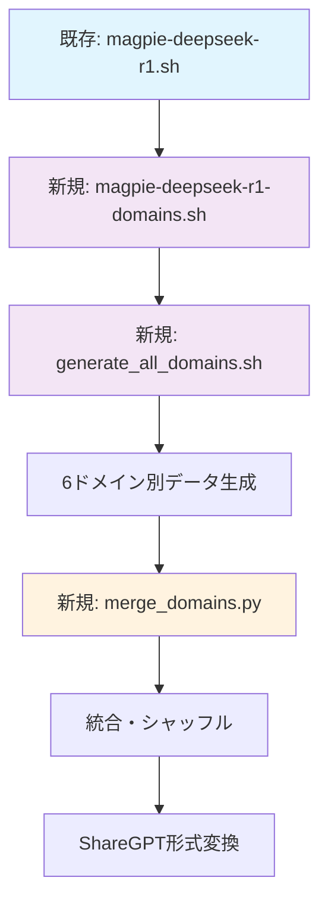

# 🔄 変更履歴とオリジナルとの差分

## 📅 2025年1月27日 - 6ドメインデータセット生成・統合機能追加

### 🎯 追加機能の概要
DeepSeek R1を使用した6つの数学ドメイン別データセット生成・統合機能を追加しました。**オリジナルコードの変更は最小限**に抑え、新機能は独立したスクリプトとして実装しています。

### 📁 新規追加ファイル

#### 1. **scripts/magpie-deepseek-r1-domains.sh**
- **目的**: ドメイン特化データ生成
- **ベース**: `magpie-deepseek-r1.sh`の拡張版
- **変更点**: ドメインパラメータ追加、ログ出力にドメイン名追加

```bash
# 使用例
./magpie-deepseek-r1-domains.sh algebra deepseek-ai/DeepSeek-R1 100
```

#### 2. **scripts/generate_all_domains.sh**
- **目的**: 6ドメイン一括生成
- **機能**: algebra, applied-mathematics, calculus, discrete-mathematics, geometry, number-theory
- **特徴**: 完全自動化、エラー処理付き

```bash
# 使用例
./generate_all_domains.sh
```

#### 3. **scripts/merge_domains.py**
- **目的**: ドメイン別データの統合・シャッフル
- **機能**: 
  - DeepSeek R1ファイル自動検出
  - 最小限メタデータ追加
  - ShareGPT形式変換
- **出力**: JSON + JSONL形式

```bash
# 使用例
python scripts/merge_domains.py --data_dir data --output_dir data
```

### 🔧 オリジナルファイルへの変更

#### ❌ **変更されていないファイル**
- `exp/gen_ins.py` - そのまま使用
- `exp/gen_res.py` - そのまま使用
- `configs/model_configs.json` - そのまま使用
- 既存の全スクリプト - そのまま保持

#### ✅ **変更されたファイル**
- `README.md` - 新機能の説明とドキュメント追加のみ

### 📊 データ形式の変更点

#### **オリジナルデータ構造（保持）**
```json
{
  "id": 0,
  "pre_query_template": "...",
  "instruction": "問題文",
  "response": "解答",
  "created": 1753420387,
  "gen_input_configs": {...},
  "gen_response_configs": {...}
}
```

#### **統合後データ構造（最小限追加）**
```json
{
  "id": 0,
  "pre_query_template": "...",    // 元のまま
  "instruction": "問題文",         // 元のまま
  "response": "解答",              // 元のまま
  "created": 1753420387,          // 元のまま
  "gen_input_configs": {...},     // 元のまま
  "gen_response_configs": {...},  // 元のまま
  "domain": "algebra",            // 新規追加（最小限）
  "source": "deepseek-r1",        // 新規追加（最小限）
  "dataset_version": "1.0"        // 新規追加（最小限）
}
```

### 🔄 ShareGPT形式への変換

#### **ShareGPT出力形式**
```json
{
  "conversation_id": "deepseek-r1-math-0",
  "domain": "algebra",
  "source": "deepseek-r1",
  "conversations": [
    {"from": "human", "value": "問題文"},
    {"from": "gpt", "value": "解答"}
  ],
  "gen_input_configs": {...},      // 元設定完全保持
  "gen_response_configs": {...},   // 元設定完全保持
  "pre_query_template": "...",     // 元設定完全保持
  "created": 1753420387,           // 元設定完全保持
  "id": 0                          // 元設定完全保持
}
```

### 🎯 設計思想

#### **最小限変更の原則**
1. **オリジナルコードは一切変更しない**
2. **新機能は独立したスクリプトで実装**
3. **既存データ形式との完全互換性維持**
4. **メタデータ追加は最小限（3フィールドのみ）**

#### **互換性の保証**
- 既存スクリプトは全て正常動作
- 既存データは全て読み込み可能
- 新機能は既存ワークフローに影響なし

### 📈 処理フロー



### 🚨 注意事項

1. **実行順序**: 必ず`generate_all_domains.sh`を先に実行
2. **権限設定**: スクリプトに実行権限付与が必要（`chmod +x *.sh`）
3. **GPU要件**: DeepSeek R1はtensor_parallel=4推奨
4. **データ保存**: `data/`フォルダに自動保存

### 🔍 検証方法

```bash
# 1. 生成データの確認
ls data/DeepSeek-R1-*/

# 2. 統合データの確認
python -c "import json; print(len(json.load(open('data/DeepSeek-R1-Math-Combined-*.json'))))"

# 3. ドメイン分布の確認
python -c "
import json
data = json.load(open('data/DeepSeek-R1-Math-Combined-*.json'))
domains = {}
for item in data:
    domains[item['domain']] = domains.get(item['domain'], 0) + 1
print(domains)
"
```

### 📝 今後の拡張可能性

1. **ドメイン追加**: 新ドメインは`generate_all_domains.sh`に追加するだけ
2. **モデル変更**: `magpie-deepseek-r1-domains.sh`のモデルパス変更
3. **品質評価**: 既存の`unitag.py`を活用可能
4. **フィルタリング**: 既存の`data_filter.ipynb`を活用可能

この実装により、オリジナルプロジェクトの完全性を保ちながら、6ドメインデータセット生成・統合機能を追加しました。