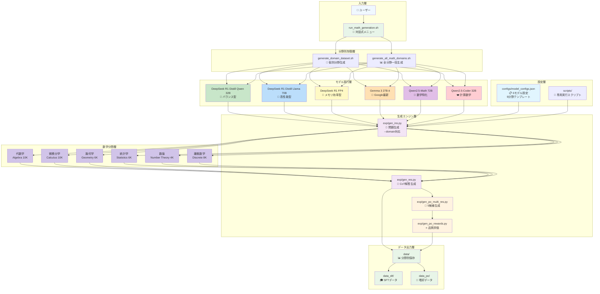
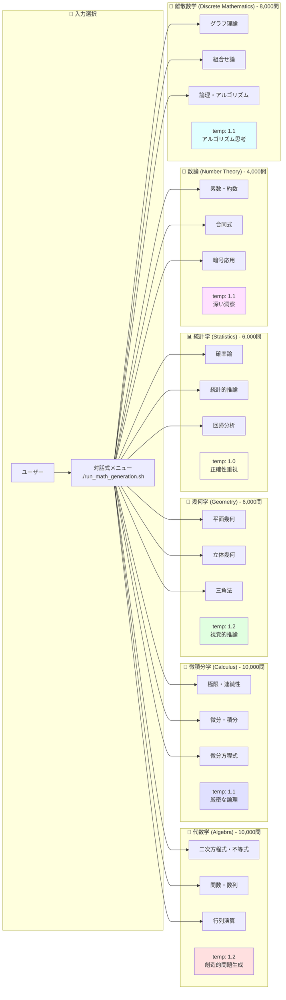
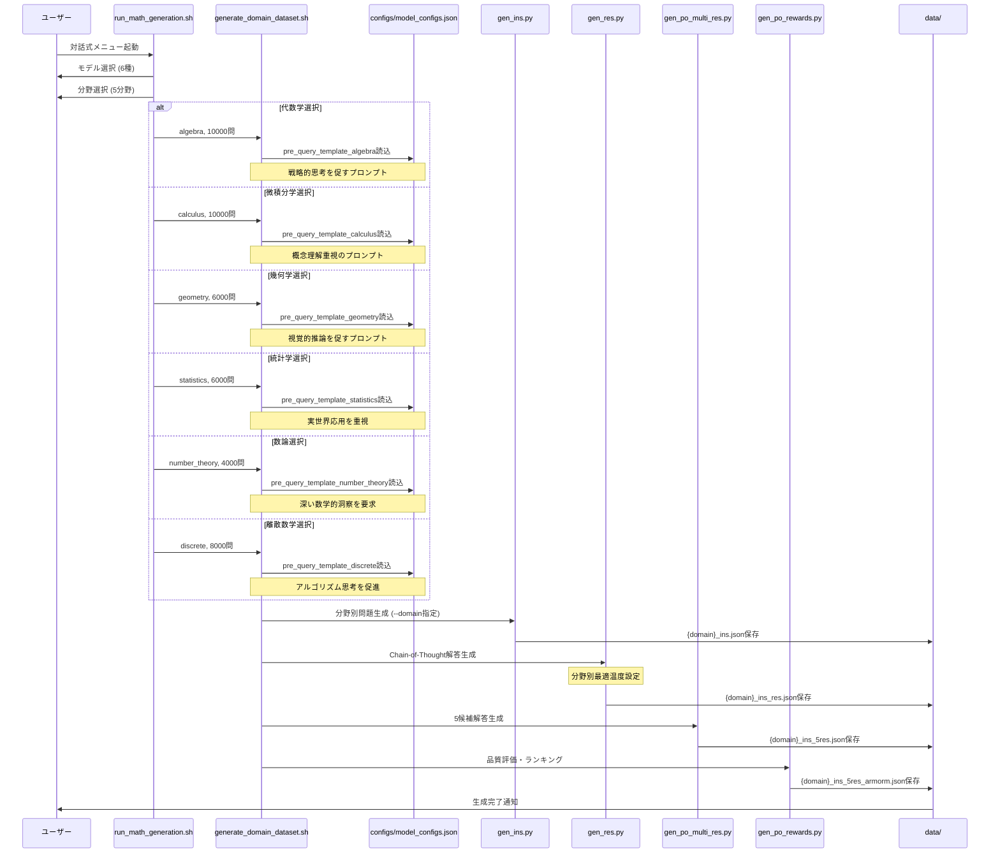

# 🧮 Magpie Reasoning - HLE数学対策特化版

[](https://magpie-align.github.io/)

[](https://arxiv.org/abs/2406.08464) [](https://opensource.org/licenses/MIT) [](https://huggingface.co/Magpie-Align)

HLE（高等レベル試験）数学対策に特化したreasoning（推論）データセット生成システム。DeepSeek R1モデルを使用して、高品質な数学推論データを生成します。

## 🚀 クイックスタート

### 🌟 Google Colab版（推奨）

[](https://colab.research.google.com/github/Ohtani-y/magpie/blob/main/generate_colab.ipynb)

**ワンクリックで始める最も簡単な方法！**
- 🎯 **対話式インターフェース**: ボタンクリックで全設定完了
- ⚡ **GPU自動設定**: T4/V100/A100で自動最適化
- 📊 **リアルタイム進捗**: 生成過程を視覚的に確認
- 📦 **ワンクリックダウンロード**: 生成データを即座にダウンロード

### 🖥️ ローカル環境版

```bash
# インストール
git clone https://github.com/Ohtani-y/magpie.git
cd magpie
pip install -r requirements.txt

# 対話式メニューで簡単生成（推奨）
cd scripts
./run_math_generation.sh

# または個別実行
./magpie-deepseek-r1.sh deepseek-ai/DeepSeek-R1 1000
```

## 🎯 特徴

- **🏆 最高難易度数学問題**: IMO、Putnam、PhD級の最難関レベル問題生成
- **🧠 超深層推論**: 10-20ステップの詳細な証明・解析チェーン（4096トークン）
- **6分野数学特化**: 代数・微積分・幾何・統計・数論・離散数学の研究レベル問題
- **6モデル対応**: DeepSeek R1 Distill、Gemma 3、Qwen2.5シリーズに最適化
- **研究レベルプロンプト**: 各分野で最先端の数学理論を要求するシステムプロンプト
- **対話式生成**: 簡単操作で最大44,000問の最高品質データセット
- **拡張Chain-of-Thought**: 大学院レベルの段階的思考プロセス（4096トークン）
- **高度な嗜好データ**: 5-7候補応答による精密な品質評価システム

## 📚 SFTとAlignデータの違い

### 🎓 SFT（Supervised Fine-Tuning）データ
- **目的**: モデルに基本的な数学問題解決能力を教える
- **構造**: 問題（instruction）と正解（response）のペア
- **用途**: 基礎的な数学推論能力の向上

### 🎯 Align（嗜好データ）
- **目的**: モデルの解答品質と人間の嗜好を一致させる
- **構造**: 問題に対する複数の候補解答とその品質評価
- **用途**: DPOやRLHFによる出力品質の向上

## 📊 生成データの例

### 問題例
```
微積分学において、関数 f(x) = x³ - 3x² + 2x - 1 の極値を求め、
その性質について詳しく説明してください。
```

### 解答例（Chain-of-Thought）
```
この問題を段階的に解決していきます。

**ステップ1: 導関数の計算**
f'(x) = 3x² - 6x + 2

**ステップ2: 極値候補の特定**
f'(x) = 0 となる点を求めます...
[詳細な解答が続く]
```

## 🛠️ 対応モデル（HLE数学特化版）

### 限定6モデル対応

|モデル | GPU要件 | 推奨用途 | 実行スクリプト |
|-------|:-----:|:--------|:------------|
| **DeepSeek R1 Distill Qwen 32B** | V100 32GB+ | バランス型（推奨） | `./magpie-deepseek-r1-distill-qwen-32b.sh` |
| **DeepSeek R1 Distill Llama 70B** | A100 80GB | 高性能型 | `./magpie-deepseek-r1-distill-llama-70b.sh` |
| **DeepSeek R1 0528 FP4** | RTX 4090+ | メモリ効率型 | `./magpie-deepseek-r1-fp4.sh` |
| **Gemma 3 27B-it** | V100 32GB+ | Google最新モデル | `./magpie-gemma3-27b.sh` |
| **Qwen2.5-Math 72B** | A100 80GB | 数学特化モデル | `./magpie-qwen2.5-math-72b.sh` |
| **Qwen2.5-Coder 32B** | V100 32GB+ | 計算数学特化 | `./magpie-qwen25-coder-32b.sh` |

## 📊 分野別数学データセット

|数学分野 | データセット | 問題数 | 特徴 |
|-------------|:-------|:-------|:-------|
| **代数学 (Algebra)** | Magpie-Algebra-HLE-10K | 10,000 | 二次方程式、不等式、関数、数列、行列 |
| **微積分学 (Calculus)** | Magpie-Calculus-HLE-10K | 10,000 | 極限、微分、積分、応用問題、微分方程式 |
| **幾何学 (Geometry)** | Magpie-Geometry-HLE-6K | 6,000 | 平面・立体幾何、三角法、証明・作図 |
| **統計学 (Statistics)** | Magpie-Statistics-HLE-6K | 6,000 | 確率、統計的推論、回帰、データ分析 |
| **数論 (Number Theory)** | Magpie-NumberTheory-HLE-4K | 4,000 | 素数論、合同式、ディオファントス方程式 |
| **離散数学 (Discrete Math)** | Magpie-Discrete-HLE-8K | 8,000 | グラフ理論、組合せ論、論理、アルゴリズム |

### 🎯 生成方法

```bash
# 1. 対話式メニュー（最も簡単）
./run_math_generation.sh

# 2. 個別分野生成
./generate_domain_dataset.sh <model> <domain> <count>

# 3. 全分野一括生成（44K問題）
./generate_all_math_domains.sh <model>

# 例：代数学10,000問生成
./generate_domain_dataset.sh deepseek-ai/DeepSeek-R1-Distill-Qwen-32B algebra 10000
```

## 🎯 GPU要件

- **推奨**: NVIDIA A100 (80GB)
- **最小**: NVIDIA V100 (32GB) または RTX 4090 (24GB)

## 📁 アーキテクチャ図



## 📂 詳細フォルダ構成

```
magpie/
├── 📋 configs/
│   └── model_configs.json      # 20+モデルの設定・テンプレート
├── 🚀 scripts/
│   ├── run_math_generation.sh       # 対話式メニュー（推奨）
│   ├── generate_domain_dataset.sh   # 個別分野生成
│   ├── generate_all_math_domains.sh # 全分野一括生成
│   ├── magpie-deepseek-r1-distill-qwen-32b.sh  # DeepSeek R1 Distill Qwen
│   ├── magpie-deepseek-r1-distill-llama-70b.sh # DeepSeek R1 Distill Llama
│   ├── magpie-deepseek-r1-fp4.sh    # DeepSeek R1 FP4量子化版
│   ├── magpie-gemma3-27b.sh         # Gemma 3 27B
│   ├── magpie-qwen2.5-math-72b.sh   # Qwen2.5-Math 72B
│   └── magpie-qwen25-coder-32b.sh   # Qwen2.5-Coder 32B
├── 🔧 exp/                    # コア生成エンジン
│   ├── gen_ins.py             # 数学問題生成（制御タスク対応）
│   ├── gen_res.py             # Chain-of-Thought解答生成
│   ├── gen_po_multi_res.py    # 複数候補解答生成
│   ├── gen_po_rewards.py      # 品質評価システム
│   └── utils.py               # 共通ユーティリティ
├── 📊 data/                   # 生成データ保存場所
│   ├── DeepSeek-R1-Distill-Qwen-32B_*/ # DeepSeek R1 Distillデータ
│   ├── Qwen2.5-Math-72B_*/     # Qwen2.5-Math生成データ
│   ├── Gemma-3-27B_*/          # Gemma 3生成データ
│   └── [model]_[domain]_[timestamp]/ # ドメイン別データ
├── 🎓 data_sft/              # SFT用データ処理
│   ├── *.jsonl               # ShareGPT形式データ
│   ├── data_concatenation.ipynb  # データ結合処理
│   └── data_filter.ipynb         # データフィルタリング
├── 🎯 data_po/               # 嗜好データ処理
│   ├── example_*_7res.json   # 複数候補解答データ（ドメイン生成）
│   ├── *_armorm.json         # 品質評価結果
│   └── process_po.ipynb      # 嗜好データ処理
├── 🖥️ demo_production.ipynb  # 本番環境用ノートブック
├── 🌟 generate_colab.ipynb   # Google Colab対話式ノートブック（推奨）
└── 📄 README.md              # プロジェクトドキュメント
```

## 🔄 数学分野別生成プロセス

### 分野別データ生成フロー


### 生成プロセス詳細


### データ形式の変遷
1. **Raw Generation**: `*_ins.json` (問題のみ)
2. **With Responses**: `*_ins_res.json` (問題+解答)  
3. **Quality Assessed**: `*_quality.json` (品質評価付き)
4. **Multi-Response**: `*_5res.json` (複数候補解答)
5. **Preference Data**: `*_armorm.json` (嗜好ランキング)

## 💡 詳細な使用方法

### 🎯 分野特化生成の特徴

各数学分野には専用のシステムプロンプトが適用され、深い数学的思考を促進します：

#### 📐 代数学 (Algebra)
- **対象範囲**: 線形・二次方程式、連立方程式、不等式、関数、数列・級数、行列演算
- **専門性**: 機械的計算ではなく戦略的思考を重視
- **出力例**: 複素数を含む多項式の因数分解、関数の性質分析

#### 🔢 微積分学 (Calculus)  
- **対象範囲**: 極限・連続性、微分・積分技法、応用問題、微分方程式、多変数解析
- **専門性**: 概念理解を重視し、グラフィカル解釈を含む
- **出力例**: 最適化問題、関連する変化率、Taylor級数展開

#### 📏 幾何学 (Geometry)
- **対象範囲**: ユークリッド幾何、座標幾何、ベクトル、三角法、立体幾何
- **専門性**: 視覚的思考と空間的推論を促進
- **出力例**: 図形証明、座標変換、幾何不等式

#### 📊 統計学 (Statistics)
- **対象範囲**: 確率論、統計的推論、回帰分析、ベイズ統計、データ分析
- **専門性**: 実世界の文脈と結果の解釈を重視
- **出力例**: 仮説検定、信頼区間、統計モデリング

#### 🔢 数論 (Number Theory)
- **対象範囲**: 素数・約数、合同式、ディオファントス方程式、暗号への応用
- **専門性**: 深い数学的洞察と証明技法を要求
- **出力例**: 素数判定アルゴリズム、暗号理論の数学的基礎

#### 🔲 離散数学 (Discrete Mathematics)
- **対象範囲**: グラフ理論、組合せ論、論理学、集合論、再帰関係、アルゴリズム理論
- **専門性**: アルゴリズム思考と構造的推論を重視、帰納法・対偶証明を多用
- **出力例**: グラフの最短経路問題、組合せ最適化、論理回路設計、計算量解析
- **応用分野**: コンピュータサイエンス、情報工学、暗号学、ネットワーク理論

### 🏆 モデル別推奨設定

| モデル | 代数学 | 微積分学 | 幾何学 | 統計学 | 数論 | 離散数学 |
|--------|:-----:|:-------:|:-----:|:-----:|:---:|:-------:|
| **DeepSeek R1 Distill Qwen 32B** | ⭐⭐⭐⭐⭐ | ⭐⭐⭐⭐⭐ | ⭐⭐⭐⭐ | ⭐⭐⭐⭐ | ⭐⭐⭐⭐⭐ | ⭐⭐⭐⭐⭐ |
| **DeepSeek R1 Distill Llama 70B** | ⭐⭐⭐⭐⭐ | ⭐⭐⭐⭐⭐ | ⭐⭐⭐⭐⭐ | ⭐⭐⭐⭐⭐ | ⭐⭐⭐⭐⭐ | ⭐⭐⭐⭐⭐ |
| **Qwen2.5-Math 72B** | ⭐⭐⭐⭐⭐ | ⭐⭐⭐⭐⭐ | ⭐⭐⭐⭐ | ⭐⭐⭐⭐ | ⭐⭐⭐⭐ | ⭐⭐⭐⭐ |
| **Qwen2.5-Coder 32B** | ⭐⭐⭐⭐ | ⭐⭐⭐⭐ | ⭐⭐⭐ | ⭐⭐⭐⭐⭐ | ⭐⭐⭐⭐ | ⭐⭐⭐⭐⭐ |
| **Gemma 3 27B-it** | ⭐⭐⭐⭐ | ⭐⭐⭐⭐ | ⭐⭐⭐⭐ | ⭐⭐⭐ | ⭐⭐⭐ | ⭐⭐⭐⭐ |
| **DeepSeek R1 FP4** | ⭐⭐⭐ | ⭐⭐⭐ | ⭐⭐⭐ | ⭐⭐⭐ | ⭐⭐⭐ | ⭐⭐⭐ |

### 📈 パフォーマンス指標 (2025年1月時点)

- **DeepSeek R1シリーズ**: AIME 2024で79.8%、MATH-500で97.3%の最高性能
- **Qwen2.5-Math 72B**: MATH benchmarkで80%+、128Kトークン対応
- **Gemma 3 27B**: Google最新モデル、バランス型性能
- **量子化版**: FP4量子化により70%のメモリ削減を実現

## 🌟 Google Colab詳細ガイド

### 🎯 Colab版の特徴

**⚡ 即座に開始**:
- 環境構築不要でブラウザから直接実行
- T4/V100/A100 GPU自動検出・最適化
- 依存関係の自動インストール

**🎮 直感的操作**:
```python
# 対話式ウィジェットでモデル選択
model_selector = widgets.Dropdown(
    options=[
        "1: DeepSeek R1 Distill Qwen 32B - バランス型（推奨）",
        "2: DeepSeek R1 Distill Llama 70B - 高性能型", 
        "3: DeepSeek R1 FP4 - メモリ効率型",
        "4: Gemma 3 27B - Google最新モデル",
        "5: Qwen2.5-Math 72B - 数学特化モデル",
        "6: Qwen2.5-Coder 32B - 計算数学特化"
    ]
)
```

**📊 リアルタイム監視**:
- GPU使用率・メモリ監視
- 生成進捗のリアルタイム表示
- サンプルデータの即座プレビュー

**📦 簡単ダウンロード**:
- ワンクリックでZIP圧縮・ダウンロード
- 全データセット（JSON、メタデータ）を一括取得
- Google Drive連携も可能

### 🚀 Colab実行手順

1. **ノートブック起動**: [](https://colab.research.google.com/github/Ohtani-y/magpie/blob/main/generate_colab.ipynb)

2. **GPU設定**: `ランタイム` → `ランタイムの変更` → `T4 GPU`を選択

3. **セットアップ実行**: 最初のセルを実行して環境構築

4. **対話式生成**: ウィジェットでモデル・分野を選択し生成開始

5. **結果確認**: 生成データをプレビュー・ダウンロード

### 💡 Colab使用のヒント

- **長時間実行**: Pro版推奨（12時間連続実行可能）
- **メモリ管理**: 大きなモデルは段階的に実行
- **データ保存**: 定期的にGoogle Driveに保存
- **エラー対処**: ランタイム再起動で多くの問題が解決

## 📖 詳細ドキュメント

- **論文**: [Magpie: Alignment Data Synthesis from Scratch](https://arxiv.org/abs/2406.08464)
- **元プロジェクト**: [Magpie-Align](https://magpie-align.github.io/)
- **モデルページ**: [DeepSeek R1](https://huggingface.co/deepseek-ai/DeepSeek-R1)

## 📄 ライセンス

このプロジェクトはMITライセンスの下で公開されています。

## 🙏 謝辞

このプロジェクトは、元のMagpieプロジェクトをベースに、HLE数学対策に特化した改良を加えたものです。元の研究チームに深く感謝いたします。