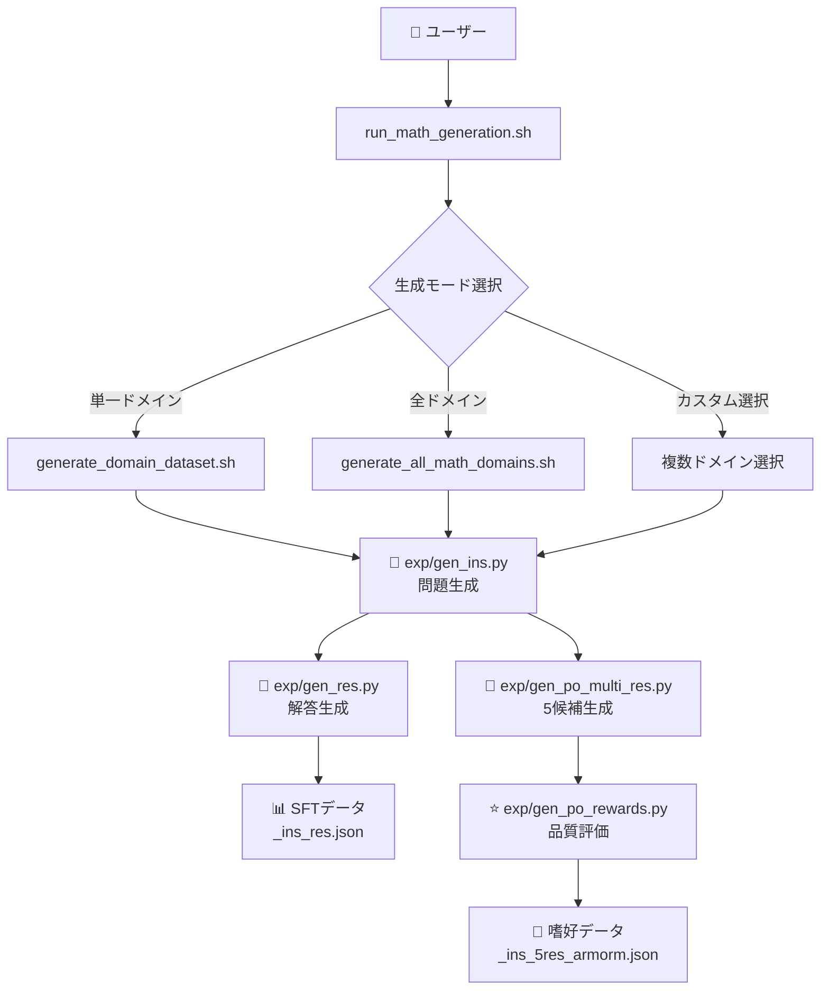

# 🧮 Magpie Reasoning - HLE数学対策特化版

[](https://magpie-align.github.io/)

[](https://arxiv.org/abs/2406.08464) [](https://opensource.org/licenses/MIT) [](https://huggingface.co/Magpie-Align)

HLE（高等レベル試験）数学対策に特化したreasoning（推論）データセット生成システム。DeepSeek R1モデルを使用して、高品質な数学推論データを生成します。

## 🚀 クイックスタート

### 🖥️ ローカル環境版

```bash
# インストール
git clone https://github.com/Ohtani-y/magpie.git
cd magpie
pip install -r requirements.txt

# 対話式メニューで簡単生成（推奨）
cd scripts
./run_math_generation.sh

# 数値引数で直接実行（より高速）
./run_math_generation.sh 1 1.0 1      # DeepSeek-Qwen-32Bで全ドメイン100%(44K問題)
./run_math_generation.sh 5 0.5 1      # Qwen-Math-72Bで全ドメイン50%(22K問題)  
./run_math_generation.sh 2 0.5 2 2    # DeepSeek-Llama-70Bで微積分50%(5K問題)
./run_math_generation.sh -h           # 日本語ヘルプを表示
```

## 🎯 主な特徴

- **🏆 最高難易度数学問題**: IMO、Putnam、PhD級の最難関レベル問題生成
- **🧠 超深層推論**: 10-20ステップの詳細な証明・解析チェーン（4096トークン）
- **📚 6分野数学特化**: 代数・微積分・幾何・統計・数論・離散数学の研究レベル問題
- **🤖 6モデル対応**: DeepSeek R1 Distill、Gemma 3、Qwen2.5シリーズに最適化
- **📊 完全パイプライン**: SFTデータと嗜好データを一度に生成

## 📋 使い方

### 基本的な使い方

```bash
./run_math_generation.sh [モデル番号] [生成倍率] [モード番号] [ドメイン番号]
```

**引数の説明：**
- **モデル番号**: 1=DeepSeek-R1-Distill-Qwen-32B, 2=DeepSeek-R1-Distill-Llama-70B, 3=DeepSeek-R1-FP4, 4=Gemma-3-27B, 5=Qwen2.5-Math-72B, 6=Qwen2.5-Coder-32B
- **生成倍率**: 0.1=10%, 0.5=50%, 1.0=100%(標準), 2.0=200%（10の位で四捨五入）
- **モード番号**: 1=全ドメイン(44K問題), 2=単一ドメイン, 3=カスタム選択（対話モードのみ）
- **ドメイン番号**: 1=代数(10K), 2=微積分(10K), 3=幾何(6K), 4=統計(6K), 5=数論(4K), 6=離散数学(8K)

### デフォルト生成数（HLE最適化）

この配分は**HLE（高等レベル試験）の出題傾向**と**最新の数学推論研究**（[arXiv:2502.15631](https://arxiv.org/abs/2502.15631)）に基づいて最適化されています：

| ドメイン | デフォルト問題数 | HLE最適化の理由 | 推論特性 |
|----------|:---------------:|:-----|:-----|
| **代数** | 10,000問 | HLEの基礎、他分野への応用が必須。大学院入試で最頻出 | 中程度の推論負荷、トークン効率良好 |
| **微積分** | 10,000問 | 研究レベルの数学で最重要。IMO・Putnam大会の中核分野 | 段階的推論、トークン使用量と精度が比例 |
| **幾何** | 6,000問 | 高度な証明力を要求。視覚的直感と厳密な論理の融合が必要 | **高推論負荷**、トークン消費多いが正答困難 |
| **統計** | 6,000問 | データサイエンス・機械学習の基礎。実用的な応用問題が中心 | 計算集約的、適度なトークン効率 |
| **数論** | 4,000問 | 最も抽象的で難解。PhD級の深い洞察を要求する特殊分野 | 極高難易度、「うまく考える」戦略が必須 |
| **離散数学** | 8,000問 | CS理論の基礎。アルゴリズム・暗号理論で必須の知識 | **高推論負荷**、トークン消費と精度の逓減効果顕著 |

> **研究的背景**  
> 難易度が上がるほど推論token消費量は増加する傾向がありますが、「token消費量の多さ＝精度向上」ではありません。特に離散数学や幾何など推論負荷の高い領域では、tokenを多く消費しても正答困難な問題が多いことが報告されています（[arXiv:2502.15631](https://arxiv.org/abs/2502.15631)）。討論では「推論tokenの長さだけでモデル能力を測ることの限界」や「高難易度問題への適合戦略」が議論されました。
> また、高度モデルでは「長く考える」よりも「うまく考える」ことが重要であり、token割当ての最適化や、token増加による精度向上の逓減的効果（diminishing return）も指摘されています。
> これらを踏まえ、本プロジェクトでは単なるtoken消費量でなく、領域ごとの推論負荷や精度特性に基づいてモデル・データ設計を最適化しています。

## 📊 生成されるデータ

`run_math_generation.sh` は完全なデータ生成パイプラインを実行し、**SFTデータ** と **嗜好データ** の両方を生成します。

### 生成される4つのファイル：

1. **`<domain>_ins.json`** - 問題のみ
2. **`<domain>_ins_res.json`** - 問題＋解答（**SFTデータ**）
3. **`<domain>_ins_5res.json`** - 問題＋5つの候補解答
4. **`<domain>_ins_5res_armorm.json`** - 問題＋評価済み候補（**嗜好データ/Alignデータ**）

**一度の実行で両方のデータタイプが生成されます**：
- **SFTデータ** (`_ins_res.json`) → 基礎学習用（Supervised Fine-Tuning）
- **嗜好データ** (`_ins_5res_armorm.json`) → 品質向上用（DPO/RLHF）

## 📁 出力ファイルと保存先

### ファイル保存先
すべての生成ファイルは **`data/`ディレクトリ** に保存されます。

### ファイル名形式
```
<モデル名>_<ドメイン名>_<データタイプ>.json
```

### 具体例：`./run_math_generation.sh 1 1.0 1`を実行した場合

```
data/
├── DeepSeek-R1-Distill-Qwen-32B_algebra_ins.json                 (10,000問)
├── DeepSeek-R1-Distill-Qwen-32B_algebra_ins_res.json            (SFTデータ)
├── DeepSeek-R1-Distill-Qwen-32B_algebra_ins_5res.json           (5候補)
├── DeepSeek-R1-Distill-Qwen-32B_algebra_ins_5res_armorm.json    (嗜好データ)
├── DeepSeek-R1-Distill-Qwen-32B_calculus_ins.json               (10,000問)
├── DeepSeek-R1-Distill-Qwen-32B_calculus_ins_res.json           (SFTデータ)
├── DeepSeek-R1-Distill-Qwen-32B_calculus_ins_5res.json          (5候補)
├── DeepSeek-R1-Distill-Qwen-32B_calculus_ins_5res_armorm.json   (嗜好データ)
│   ... (他のドメインも同様)
└── 合計: 24ファイル (6ドメイン × 4ファイルタイプ)
```

### ファイルサイズ目安
- **全ドメイン(44K問題)**: 約 15-20GB
- **単一ドメイン(10K問題)**: 約 2-4GB
- **ディスク空き容量**: 30GB以上推奨

### ファイル形式詳細

| ファイルタイプ | 内容 | 用途 | サイズ目安 |
|------------|------|------|----------|
| `*_ins.json` | 問題のみ | 問題データベース | 50-100MB |
| `*_ins_res.json` | 問題+解答 | **SFTデータ** | 500-800MB |
| `*_ins_5res.json` | 問題+5候補解答 | 候補生成 | 2-3GB |
| `*_ins_5res_armorm.json` | 評価済み候補 | **嗜好データ** | 1-2GB |

📝 **詳細な実行ガイド**: [EXECUTION_GUIDE.md](EXECUTION_GUIDE.md) を参照

## 💻 システム要件

### GPU要件
- **推奨**: NVIDIA A100 (80GB)
- **最小**: NVIDIA V100 (32GB) または RTX 4090 (24GB)

### 対応モデル（6種類）

| モデル番号 | モデル名 | 特徴 | GPU要件 |
|:--------:|---------|------|---------|
| 1 | DeepSeek-R1-Distill-Qwen-32B | バランス型（推奨） | V100 32GB |
| 2 | DeepSeek-R1-Distill-Llama-70B | 高性能型 | A100 80GB |
| 3 | DeepSeek-R1-0528-FP4 | メモリ効率型 | RTX 4090 |
| 4 | Gemma-3-27B-it | Google最新 | V100 32GB |
| 5 | Qwen2.5-Math-72B | 数学特化 | A100 80GB |
| 6 | Qwen2.5-Coder-32B | 計算数学 | V100 32GB |

## 🔄 データ生成フローと処理時間



### ⏱️ 処理時間目安

| GPU | 全ドメイン(44K問題) | 単一ドメイン(10K問題) | メモリ使用量 |
|-----|-------------------|---------------------|-------------|
| RTX 4090 (24GB) | 6-8時間 | 1-2時間 | ~20GB |
| V100 (32GB) | 4-6時間 | 1時間 | ~28GB |
| A100 (80GB) | 2-4時間 | 30分 | ~35GB |

## 📖 詳細ドキュメント

- [公式Magpieドキュメント](https://github.com/magpie-align)
- [技術論文](https://arxiv.org/abs/2406.08464)

## 📄 ライセンス

コード: MIT License  
生成データ: CC BY-NC 4.0

## 🙏 謝辞

本プロジェクトは[Magpie-Align](https://github.com/magpie-align)プロジェクトをベースに、HLE数学試験対策に特化させたものです。