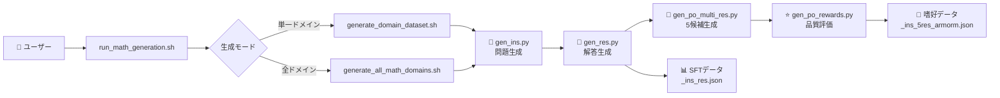

# 🧮 Magpie Reasoning - HLE数学対策特化版

[](https://magpie-align.github.io/)

[](https://arxiv.org/abs/2406.08464) [](https://opensource.org/licenses/MIT) [](https://huggingface.co/Magpie-Align)

HLE（高等レベル試験）数学対策に特化したreasoning（推論）データセット生成システム。DeepSeek R1モデルを使用して、高品質な数学推論データを生成します。

## 🚀 クイックスタート

### 🌟 Google Colab版（推奨）

[](https://colab.research.google.com/github/Ohtani-y/magpie/blob/main/generate_colab.ipynb)

**ワンクリックで始める最も簡単な方法！**
- 🎯 **対話式インターフェース**: ボタンクリックで全設定完了
- ⚡ **GPU自動設定**: T4/V100/A100で自動最適化
- 📊 **リアルタイム進捗**: 生成過程を視覚的に確認
- 📦 **ワンクリックダウンロード**: 生成データを即座にダウンロード

### 🖥️ ローカル環境版

```bash
# インストール
git clone https://github.com/Ohtani-y/magpie.git
cd magpie
pip install -r requirements.txt

# 対話式メニューで簡単生成（推奨）
cd scripts
./run_math_generation.sh

# 数値引数で直接実行（より高速）
./run_math_generation.sh 1 1 1        # DeepSeek-Qwen-32Bで代数10K問題
./run_math_generation.sh 5 2          # Qwen-Math-72Bで全ドメイン44K問題  
./run_math_generation.sh 2 1 2 5000   # DeepSeek-Llama-70Bで微積分5000問題
./run_math_generation.sh -h           # 日本語ヘルプを表示
```

## 🎯 主な特徴

- **🏆 最高難易度数学問題**: IMO、Putnam、PhD級の最難関レベル問題生成
- **🧠 超深層推論**: 10-20ステップの詳細な証明・解析チェーン（4096トークン）
- **📚 6分野数学特化**: 代数・微積分・幾何・統計・数論・離散数学の研究レベル問題
- **🤖 6モデル対応**: DeepSeek R1 Distill、Gemma 3、Qwen2.5シリーズに最適化
- **📊 完全パイプライン**: SFTデータと嗜好データを一度に生成

## 📋 使い方

### 基本的な使い方

```bash
./run_math_generation.sh [モデル番号] [モード番号] [ドメイン番号] [問題数]
```

**引数の説明：**
- **モデル番号**: 1=DeepSeek-Qwen-32B, 2=DeepSeek-Llama-70B, 3=DeepSeek-FP4, 4=Gemma-3-27B, 5=Qwen-Math-72B, 6=Qwen-Coder-32B
- **モード番号**: 1=単一ドメイン, 2=全ドメイン(44K問題)
- **ドメイン番号**: 1=代数(10K), 2=微積分(10K), 3=幾何(6K), 4=統計(6K), 5=数論(4K), 6=離散数学(8K)

### デフォルト生成数（HLE最適化）

この配分は**HLE（高等レベル試験）の出題傾向**に基づいて最適化されています：

| ドメイン | デフォルト問題数 | HLE最適化の理由 |
|----------|:---------------:|:-----|
| **代数** | 10,000問 | HLEの基礎、他分野への応用が必須。大学院入試で最頻出 |
| **微積分** | 10,000問 | 研究レベルの数学で最重要。IMO・Putnam大会の中核分野 |
| **幾何** | 6,000問 | 高度な証明力を要求。視覚的直感と厳密な論理の融合が必要 |
| **統計** | 6,000問 | データサイエンス・機械学習の基礎。実用的な応用問題が中心 |
| **数論** | 4,000問 | 最も抽象的で難解。PhD級の深い洞察を要求する特殊分野 |
| **離散数学** | 8,000問 | CS理論の基礎。アルゴリズム・暗号理論で必須の知識 |

## 📊 生成されるデータ

`run_math_generation.sh` は完全なデータ生成パイプラインを実行し、**SFTデータ** と **嗜好データ** の両方を生成します。

### 生成される4つのファイル：

1. **`<domain>_ins.json`** - 問題のみ
2. **`<domain>_ins_res.json`** - 問題＋解答（**SFTデータ**）
3. **`<domain>_ins_5res.json`** - 問題＋5つの候補解答
4. **`<domain>_ins_5res_armorm.json`** - 問題＋評価済み候補（**嗜好データ/Alignデータ**）

**一度の実行で両方のデータタイプが生成されます**：
- **SFTデータ** (`_ins_res.json`) → 基礎学習用（Supervised Fine-Tuning）
- **嗜好データ** (`_ins_5res_armorm.json`) → 品質向上用（DPO/RLHF）

## 💻 システム要件

### GPU要件
- **推奨**: NVIDIA A100 (80GB)
- **最小**: NVIDIA V100 (32GB) または RTX 4090 (24GB)

### 対応モデル（6種類）

| モデル番号 | モデル名 | 特徴 | GPU要件 |
|:--------:|---------|------|---------|
| 1 | DeepSeek-R1-Distill-Qwen-32B | バランス型（推奨） | V100 32GB |
| 2 | DeepSeek-R1-Distill-Llama-70B | 高性能型 | A100 80GB |
| 3 | DeepSeek-R1-0528-FP4 | メモリ効率型 | RTX 4090 |
| 4 | Gemma-3-27B-it | Google最新 | V100 32GB |
| 5 | Qwen2.5-Math-72B | 数学特化 | A100 80GB |
| 6 | Qwen2.5-Coder-32B | 計算数学 | V100 32GB |

## 🔄 データ生成フロー



## 📖 詳細ドキュメント

- [公式Magpieドキュメント](https://github.com/magpie-align)
- [技術論文](https://arxiv.org/abs/2406.08464)

## 📄 ライセンス

コード: MIT License  
生成データ: CC BY-NC 4.0

## 🙏 謝辞

本プロジェクトは[Magpie-Align](https://github.com/magpie-align)プロジェクトをベースに、HLE数学試験対策に特化させたものです。