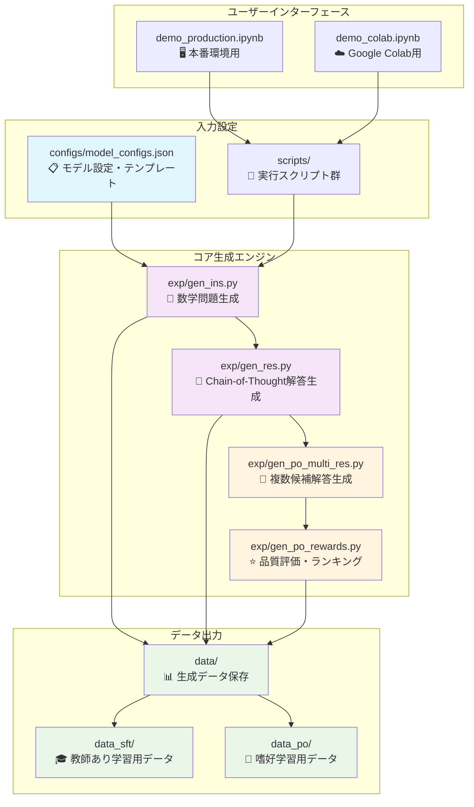
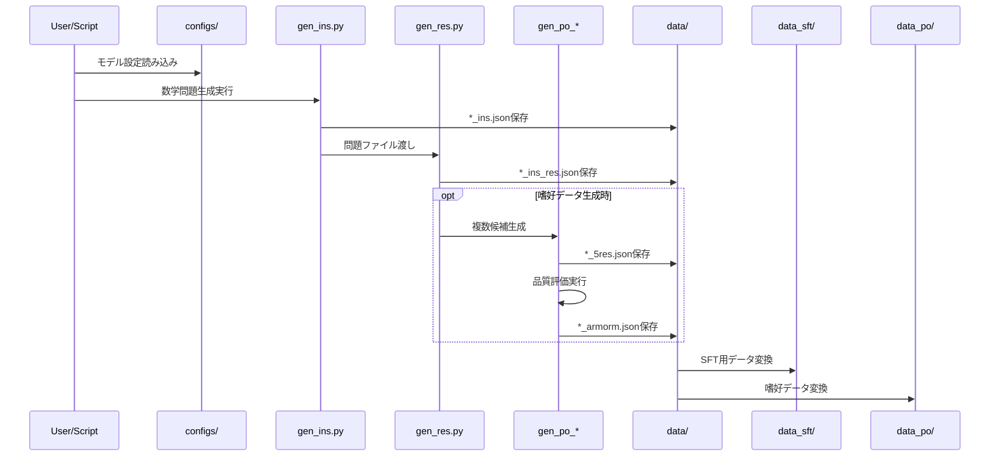

# 🧮 Magpie Reasoning - HLE数学対策特化版

[](https://magpie-align.github.io/)

[](https://arxiv.org/abs/2406.08464) [](https://opensource.org/licenses/MIT) [](https://huggingface.co/Magpie-Align)

HLE（高等レベル試験）数学対策に特化したreasoning（推論）データセット生成システム。DeepSeek R1モデルを使用して、高品質な数学推論データを生成します。

## 🚀 クイックスタート

### Google Colabで始める（推奨）

[](https://colab.research.google.com/github/Ohtani-y/magpie/blob/main/demo_colab.ipynb)

1. 上記のバッジをクリック
2. GPU設定をA100に変更（推奨、T4でも動作可）
3. セルを順番に実行
4. 生成されたデータセットをダウンロード

### ローカル環境での実行

```bash
# インストール
git clone https://github.com/Ohtani-y/magpie.git
cd magpie
pip install -r requirements.txt

# DeepSeek R1でデータ生成
cd scripts
./magpie-deepseek-r1.sh deepseek-ai/DeepSeek-R1 1000
```

## 🎯 特徴

- **HLE数学対策特化**: 高等レベル試験に必要な数学問題に焦点
- **DeepSeek R1統合**: 最新のDeepSeek R1モデルによる高品質推論
- **2種類のデータ形式**: SFT（教師あり学習）とAlign（嗜好データ）の両方に対応
- **Chain-of-Thought対応**: 段階的思考プロセスを含む推論データ
- **自動品質フィルタリング**: 高品質データの確保

## 📚 SFTとAlignデータの違い

### 🎓 SFT（Supervised Fine-Tuning）データ
- **目的**: モデルに基本的な数学問題解決能力を教える
- **構造**: 問題（instruction）と正解（response）のペア
- **用途**: 基礎的な数学推論能力の向上

### 🎯 Align（嗜好データ）
- **目的**: モデルの解答品質と人間の嗜好を一致させる
- **構造**: 問題に対する複数の候補解答とその品質評価
- **用途**: DPOやRLHFによる出力品質の向上

## 📊 生成データの例

### 問題例
```
微積分学において、関数 f(x) = x³ - 3x² + 2x - 1 の極値を求め、
その性質について詳しく説明してください。
```

### 解答例（Chain-of-Thought）
```
この問題を段階的に解決していきます。

**ステップ1: 導関数の計算**
f'(x) = 3x² - 6x + 2

**ステップ2: 極値候補の特定**
f'(x) = 0 となる点を求めます...
[詳細な解答が続く]
```

## 🛠️ 対応モデル

### Magpie対応モデル

|モデルファミリー | 対応状況 | 推奨用途 |
|-------------|:------:|:-------|
| [DeepSeek R1](https://huggingface.co/deepseek-ai/DeepSeek-R1) | ✅ 推奨 | HLE数学推論データ生成 |
| [Qwen2.5-Math](https://huggingface.co/Qwen/Qwen2.5-Math-72B-Instruct) | ✅ | 数学特化データセット |
| [Qwen2-Math](https://huggingface.co/Qwen/Qwen2-Math-7B-Instruct) | ✅ | 軽量数学データ生成 |
| [Llama 3.x](https://huggingface.co/collections/meta-llama/llama-31-669fc079a0c406a149a5738f) | ✅ | 汎用数学推論 |

### 📐 数学特化モデル（2024-2025）

#### DeepSeek数学モデル
- **DeepSeekMath 7B**: MATH benchmark 51.7%達成、競技レベル数学対応
- **DeepSeek-R1 (2025)**: AIME 2024で79.8%、MATH-500で97.3%の最高性能

#### Qwen数学モデル
- **Qwen2.5-Math (72B)**: MATH 80%+の高性能、128Kトークン対応
- **Qwen2-Math (7B)**: 軽量版数学特化モデル

#### その他の数学特化モデル
- **InternLM2.5-Math**: 1.8B～8x22Bまでの多様なサイズ展開
- **NuminaMath 1.5**: 90万問の競技レベル数学問題データセット
- **Mathstral 7B**: Mistral-7Bベースの数学特化モデル

## 🎯 GPU要件

- **推奨**: NVIDIA A100 (80GB)
- **最小**: NVIDIA V100 (32GB) または RTX 4090 (24GB)
- **Google Colab**: A100推奨（T4でも動作可能）

## 📁 アーキテクチャ図



## 📂 詳細フォルダ構成

```
magpie/
├── 📋 configs/
│   └── model_configs.json      # 20+モデルの設定・テンプレート
├── 🚀 scripts/
│   ├── magpie-deepseek-r1.sh   # DeepSeek R1専用（推奨）
│   ├── magpie-qwen2.5-math-72b.sh  # Qwen数学モデル用
│   ├── magpie-qwen2-math-7b.sh     # 軽量Qwen数学用
│   └── magpie_math.sh              # 汎用数学生成
├── 🔧 exp/                    # コア生成エンジン
│   ├── gen_ins.py             # 数学問題生成（制御タスク対応）
│   ├── gen_res.py             # Chain-of-Thought解答生成
│   ├── gen_po_multi_res.py    # 複数候補解答生成
│   ├── gen_po_rewards.py      # 品質評価システム
│   └── utils.py               # 共通ユーティリティ
├── 📊 data/                   # 生成データ保存場所
│   ├── DeepSeek-R1_*/         # DeepSeek R1生成データ
│   ├── Qwen2.5-3B-Instruct_*/ # Qwen生成データ
│   └── [model]_[timestamp]_*/ # その他モデルデータ
├── 🎓 data_sft/              # SFT用データ処理
│   ├── *.jsonl               # ShareGPT形式データ
│   ├── data_concatenation.ipynb  # データ結合処理
│   └── data_filter.ipynb         # データフィルタリング
├── 🎯 data_po/               # 嗜好データ処理
│   ├── example_*_5res.json   # 複数候補解答データ
│   ├── *_armorm.json         # 品質評価結果
│   └── process_po.ipynb      # 嗜好データ処理
├── 🖥️ demo_production.ipynb  # 本番環境用ノートブック
├── ☁️ demo_colab.ipynb       # Google Colab専用版
└── 📄 README.md              # プロジェクトドキュメント
```

## 🔄 データフロー

### 生成プロセス


### データ形式の変遷
1. **Raw Generation**: `*_ins.json` (問題のみ)
2. **With Responses**: `*_ins_res.json` (問題+解答)  
3. **Quality Assessed**: `*_quality.json` (品質評価付き)
4. **Multi-Response**: `*_5res.json` (複数候補解答)
5. **Preference Data**: `*_armorm.json` (嗜好ランキング)

## 💡 使用方法

### パラメータ説明
- `model_path`: 使用するモデル（DeepSeek R1推奨）
- `total_prompts`: 生成する問題数
- `ins_temp`: 問題生成の創造性（推奨: 1.0-1.2）
- `res_temp`: 解答生成の一貫性（推奨: 0.0-0.2）

### 推奨設定例
```bash
# 高品質な数学推論データ生成
./magpie-deepseek-r1.sh deepseek-ai/DeepSeek-R1 1000 1.0 1.2 1.0 0.1

# パラメータ詳細:
# - deepseek-ai/DeepSeek-R1: モデルパス
# - 1000: 生成問題数
# - 1.0: instruction top_p
# - 1.2: instruction temperature  
# - 1.0: response top_p
# - 0.1: response temperature
```

## 🔄 6ドメインデータセット生成・統合機能

### **新機能: ドメイン別データ生成**

```bash
# 🚀 対話型実行 (推奨)
python scripts/run_example.py

# 🌟 Google Colab実行
# https://colab.research.google.com/github/your-repo/magpie/blob/main/colab_6domains.ipynb

# 手動実行
cd scripts
chmod +x *.sh
./generate_all_domains.sh

# 個別ドメイン生成
./magpie-deepseek-r1-domains.sh algebra deepseek-ai/DeepSeek-R1 100
./magpie-deepseek-r1-domains.sh calculus deepseek-ai/DeepSeek-R1 100
```

### **新機能: データ統合・シャッフル**

```bash
# 6ドメインデータを自動統合
python scripts/merge_domains.py --data_dir data --output_dir data

# 出力例:
# - DeepSeek-R1-Math-Combined-600_20250127_143022.json
# - DeepSeek-R1-Math-Combined-600_20250127_143022_sharegpt.jsonl
```

### **対応ドメイン**
1. **Algebra** (代数学): 方程式、多項式、関数
2. **Applied Mathematics** (応用数学): 微分方程式、最適化
3. **Calculus** (微積分学): 微積分、極限、級数
4. **Discrete Mathematics** (離散数学): 組合せ、グラフ理論
5. **Geometry** (幾何学): 解析幾何、空間図形
6. **Number Theory** (数論): 素数、合同式、暗号応用

## 📝 変更点詳細

### **追加ファイル（オリジナル変更なし）**
- `scripts/magpie-deepseek-r1-domains.sh`: ドメイン特化生成スクリプト
- `scripts/generate_all_domains.sh`: 6ドメイン一括生成
- `scripts/merge_domains.py`: データ統合・シャッフルツール
- `scripts/run_example.py`: 対話型実行スクリプト（推奨）
- `colab_6domains.ipynb`: **Google Colab完全対応版**
- `SETUP.md`: 詳細セットアップガイド
- `COLAB_GUIDE.md`: **Google Colab実行ガイド**

### **データ形式の変更点**
オリジナルデータに**最小限のメタデータのみ追加**:
```json
{
  "id": 0,
  "instruction": "元の問題文",
  "response": "元の解答",
  "domain": "algebra",          // 新規追加
  "source": "deepseek-r1",      // 新規追加
  "dataset_version": "1.0",     // 新規追加
  // 他の元フィールドはそのまま保持
}
```

### **機能的変更点**
1. **ドメイン自動検出**: DeepSeek R1生成ファイルを自動認識
2. **バランス保持**: 各ドメイン均等にシャッフル
3. **ShareGPT互換**: 機械学習フレームワーク対応
4. **メタデータ保持**: 生成設定情報を完全保持
5. **実行可能化**: gen_ins.py にドメインパラメータ追加
6. **エラーハンドリング**: 生成スクリプトに堅牢なエラー処理追加

### **保持される元情報**
- 全ての`gen_input_configs`
- 全ての`gen_response_configs`
- `pre_query_template`
- `created`タイムスタンプ
- DeepSeek R1特有の設定

## 📖 詳細ドキュメント

- **論文**: [Magpie: Alignment Data Synthesis from Scratch](https://arxiv.org/abs/2406.08464)
- **元プロジェクト**: [Magpie-Align](https://magpie-align.github.io/)
- **モデルページ**: [DeepSeek R1](https://huggingface.co/deepseek-ai/DeepSeek-R1)

## 📄 ライセンス

このプロジェクトはMITライセンスの下で公開されています。

## 🙏 謝辞

このプロジェクトは、元のMagpieプロジェクトをベースに、HLE数学対策に特化した改良を加えたものです。元の研究チームに深く感謝いたします。